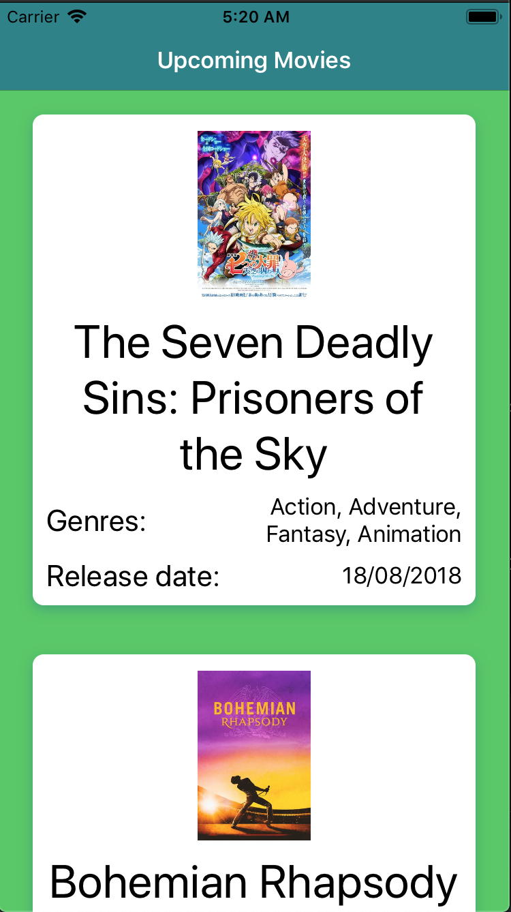
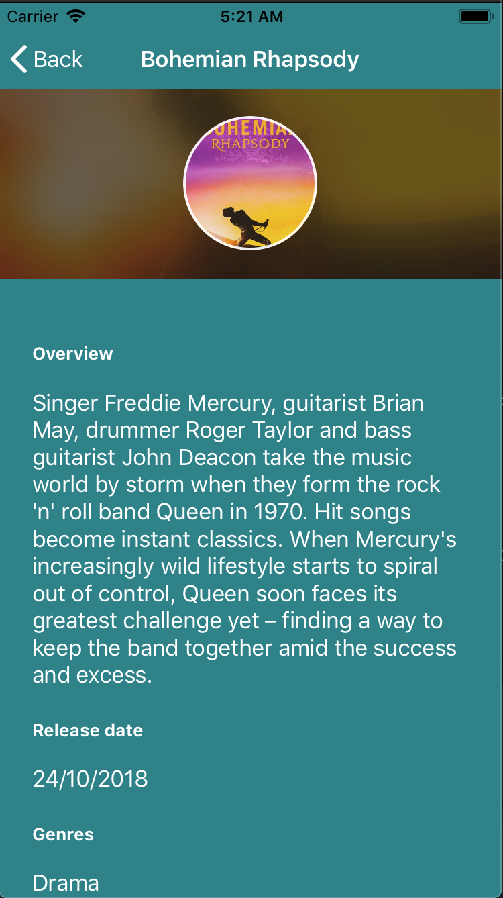
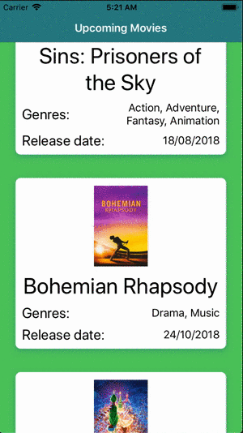

# Upcoming Movies

## Screenshots

| List | Movie | Video |
| - | - | - |
|  |  |  |

## Build instructions

Run the following command:

```bash
carthage bootstrap --platform ios
```

## Libraries used

- Alamofire (for network requests)
- AlamofireImage (for image network requests)
- RxAlamofire (wrapper to use Alamofire along with RxSwift)
- RxSwift (reactive programming library)
- ParallaxHeader (for backdrop image with animations at table view)
- SnapKit (wrapper to set constraints more easily)
